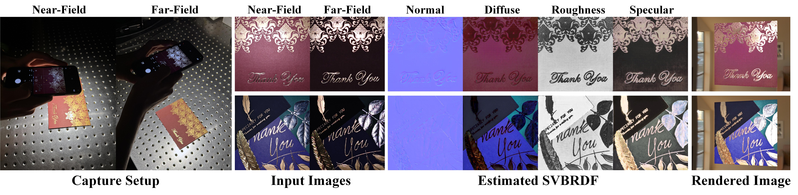

# NFPLight
This is the source code of research paper "NFPLight: Deep SVBRDF Estimation via the Combination of Near and Far Field Point lighting" (SIGGRAPH Asia 2024).
**More information (include our paper, supplementary, video) can be found at** [My Personal Page](https://cgliwang.github.io/) 


# Pretrained models
Our pretrained models can be downloaded from [here](https://drive.google.com/drive/folders/171Krs3DUGqI-IkejbtOsbPtrKpOlds2p?usp=sharing). Unzip these files to 'checkpoints' folder.

# Dependencies
```python
conda create -n nfp python=3.10
conda activate nfp
pip install -r requirements.txt
```
- Python (tested on 3.10)
- Pytorch (tested on 2.9.1+CUDA 12.8)

# Usage
- Test on synthetic data

This script tests the method on synthetic data under ideal capture settings, 
aiming to evaluate its theoretical upper-bound performance.
```Python
python test.py --save_root ./results/syn --test_data_root ./input_data/syn_data --loadpath_network_g ./checkpoints/net_g_syn.pth
```

- Test on real data

This script incorporates a denoising network for real material capture.
The model is trained at a resolution of 256, but the proposed method supports inference at 1024
to produce higher-resolution results.
```Python
python real.py --save_root ./results/real --test_data_root ./input_data/real_data --loadpath_network_g ./checkpoints/net_g_real.pth --loadpath_network_denoise ./checkpoints/net_denoise_real.pth --image_size 1024
```

# Citation
If you use our code or pretrained models, please cite as following:
```
@article{10.1145/3687978,
author = {Wang, Li and Zhang, Lianghao and Gao, Fangzhou and Kang, Yuzhen and Zhang, Jiawan},
title = {NFPLight:  Deep SVBRDF Estimation via the Combination of Near and Far Field Point Lighting},
year = {2024},
issue_date = {December 2024},
publisher = {Association for Computing Machinery},
address = {New York, NY, USA},
volume = {43},
number = {6},
issn = {0730-0301},
url = {https://doi.org/10.1145/3687978},
doi = {10.1145/3687978},
abstract = {Recovering spatial-varying bi-directional reflectance distribution function (SVBRDF) from a few hand-held captured images has been a challenging task in computer graphics. Benefiting from the learned priors from data, single-image methods can obtain plausible SVBRDF estimation results. However, the extremely limited appearance information in a single image does not suffice for high-quality SVBRDF reconstruction. Although increasing the number of inputs can improve the reconstruction quality, it also affects the efficiency of real data capture and adds significant computational burdens. Therefore, the key challenge is to minimize the required number of inputs, while keeping high-quality results. To address this, we propose maximizing the effective information in each input through a novel co-located capture strategy that combines near-field and far-field point lighting. To further enhance effectiveness, we theoretically investigate the inherent relation between two images. The extracted relation is strongly correlated with the slope of specular reflectance, substantially enhancing the precision of roughness map estimation. Additionally, we designed the registration and denoising modules to meet the practical requirements of hand-held capture. Quantitative assessments and qualitative analysis have demonstrated that our method achieves superior SVBRDF estimations compared to previous approaches. All source codes will be publicly released.},
journal = {ACM Trans. Graph.},
month = nov,
articleno = {274},
numpages = {11},
keywords = {material reflectance modeling, SVBRDF, deep learning, rendering}
}
```
